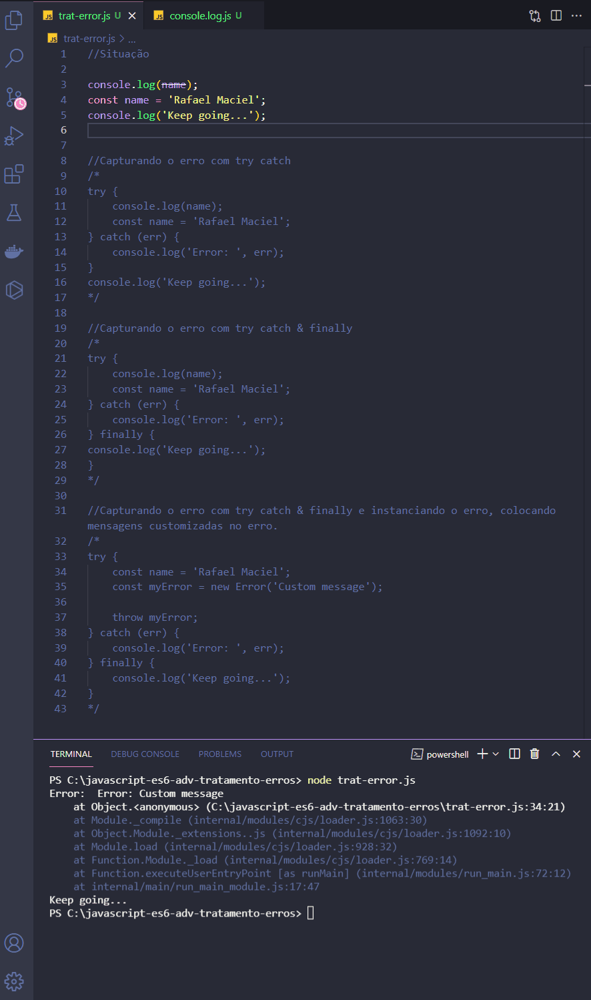
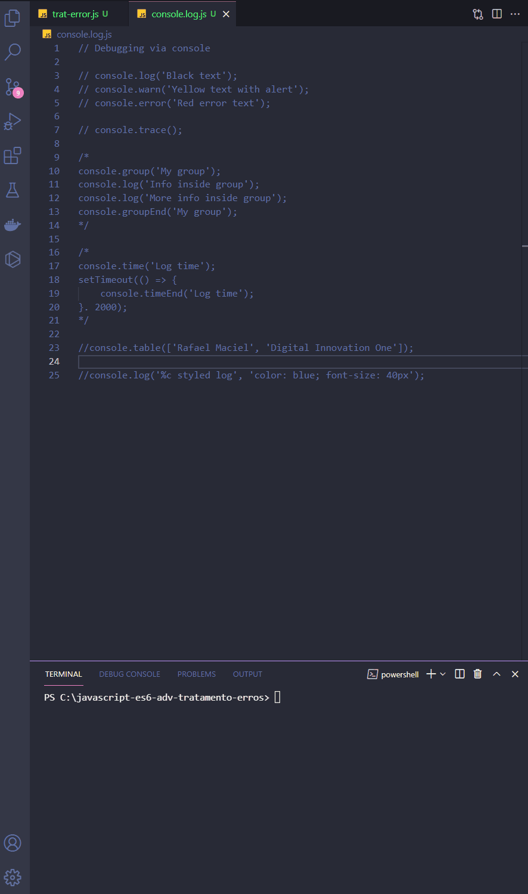

<h1 align="center">
  
   
  JavaScript ES6 - Advanced ES6 Error Handling
</h1>

<h3 align="justify">
Didactic demonstration of advanced JavaScripty ES6 error handling. Credits for the Digital Innovation One JavaScript ES6 Advanced module.
</h3>

 

## 📷 Demonstration

<h4 align="left"> error handling </h4>
  
   
<h4 align="left"> console. </h4>
  
   

 

## 🚀 Technologies

This project was developed with the following technologies:

- JavaScript ES6
- Nodejs

 

## ⚙ Commands
- try catch
- finally
- console.log('Black text');
- console.warn('Yellow text with alert');
- console.error('Red error text');
- console.trace();
- console.group('My group');
- console.log('Info inside group');
- console.log('More info inside group');
- console.groupEnd('My group');
- console.time('Log time');
setTimeout(() => {
    console.timeEnd('Log time');
}. 2000);
- console.table(['text', 'text']);
- console.log('%c styled log', 'color: blue; font-size: 40px');

 

---

Made with 💜 by Rafael Maciel
